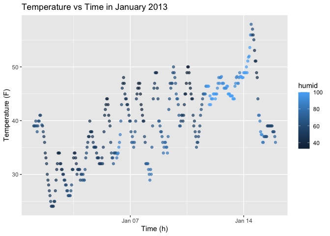

HW1
================
Yuwei Ma
2025-09-17

## Problem 1

``` r
#install.packages("moderndive")
library(moderndive)
library(tidyverse)
library(ggplot2)
data("early_january_weather")
#help("early_january_weather")
```

- The `early_january_weather` data set contains variables:
  - origin: Weather station
  - year, month, day, hour: time of recording
  - temp, dewp: Temperature and dewpoint in Fahrenheit. The mean
    temperature is 39.5821229 F.
  - humid: relative humidity
  - wind_dir, wind_speed, wind_gust: wind direction (in degrees), speed
    and gust speed (in mph)

It contains 358 rows and 15 columns of hourly meterological data from
LGA, JFK and EWR for the month of January 2013.

``` r
ggplot(early_january_weather, aes(x = time_hour, y = temp, color = humid)) +
  geom_point(alpha = 0.7)+
  labs(
    title = "Temperature vs Time in January 2013",
    x = "Time (h)",
    y = "Temperature (F)"
  )
```

<!-- -->

``` r
ggsave("temp_vs_time_hour.png", width = 8, height = 5)
```

Temperature rises and falls with a daily cycle (with higher temperature
during the day and lower during the night). Humidity tends to be higher
when temperatures are lower. In addition, as time increases, humidity
and temperature generally increases.

## Problem 2

This problem is intended to emphasize variable types and introduce
coercion; some awareness of how R treats numeric, character, and factor
variables is necessary for working with these data types in practice.

Create a data frame comprised of:

``` r
# a random sample of size 10 from a standard Normal distribution
set.seed(1234)
x <- rnorm(10)

df = tibble(
  x_numeric = x,
  x_logic = x > 0, # a logical vector indicating whether elements of the sample are greater than 0
  x_char = c("My", "name", "is", "Lucy","and","I","am","a","firstyear","student"), # a character vector of length 10 
  x_fac = factor(rep(c("low","medium","high"), length.out = 10)) # a factor vector of length 10, with 3 different factor “levels”
)
```

Try to take the mean of each variable in your dataframe. What works and
what doesn’t? Hint: for now, to take the mean of a variable in a
dataframe, you need to pull the variable out of the dataframe. Try
loading the tidyverse and using the pull function.

``` r
library(tidyverse)
mean(pull(df, x_numeric)) # works
```

    ## [1] -0.3831574

``` r
mean(pull(df, x_logic)) # works
```

    ## [1] 0.4

``` r
mean(pull(df, x_char)) # warning - returning NA
```

    ## Warning in mean.default(pull(df, x_char)): argument is not numeric or logical:
    ## returning NA

    ## [1] NA

``` r
# mean(pull(df, x_fac) # error - unexpected symbol, comment this line
```

In some cases, you can explicitly convert variables from one type to
another. Write a code chunk that applies the as.numeric function to the
logical, character, and factor variables (please show this chunk but not
the output). What happens, and why? Does this help explain what happens
when you try to take the mean?

``` r
as.numeric(pull(df, x_logic)) # 0 1 1 0 1 1 0 0 0 0
as.numeric(pull(df, x_char)) # NAs introduced by coercion 
```

    ## Warning: NAs introduced by coercion

``` r
as.numeric(pull(df, x_fac)) # 2 3 1 2 3 1 2 3 1 2
```

- Converting logic variables to numeric maps `TRUE = 1` and `FALSE = 0`.
  That means why taking the mean of a logical vector works
- Character cannot be directly coerced to numeric, so R produces `NA`
  with a warning. That’s why `mean()` fails on characters.
- Converting factor to numeric works. `as.numeric()` maps ordinal data
  to integers (`low = 1, medium = 2, high = 3`). However, `mean()` on a
  raw factor takes mean on original ordinal data instead of the numeric
  data, and that’s why there’s an error when doing that.
